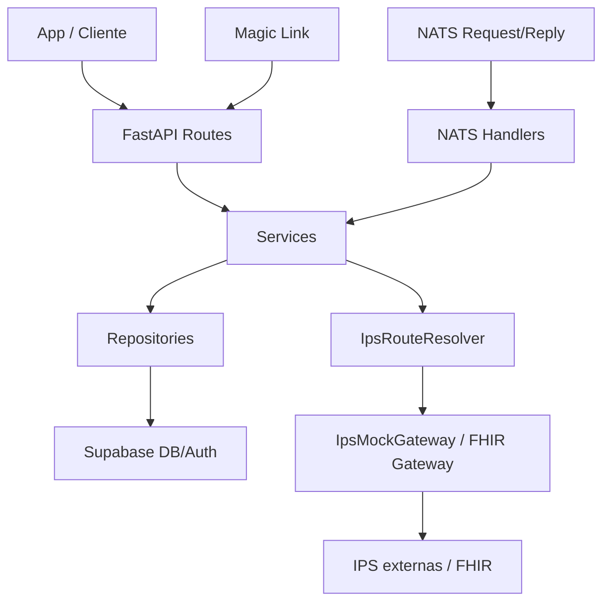
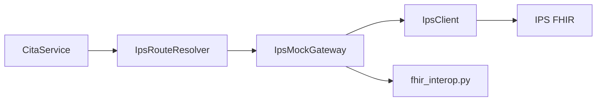
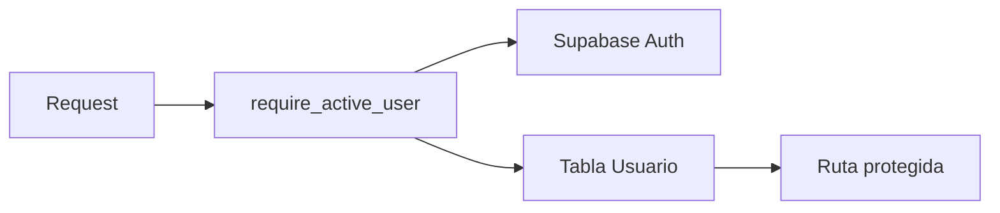
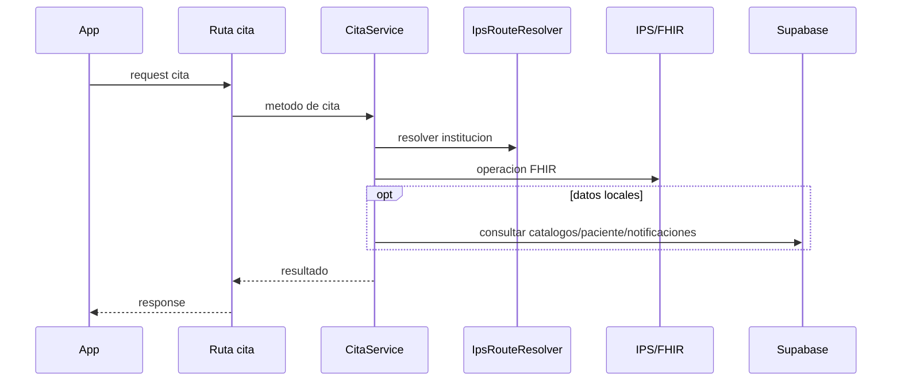

# Arquitectura del proyecto

Guía rápida para entender cómo está organizado `medix-appointments-api`.

## Qué es

API backend en FastAPI para:

- autenticación y elegibilidad de login,
- catálogos de EPS, instituciones y especialidades,
- pacientes,
- citas médicas,
- consentimiento legal,
- recomendaciones,
- dispositivos de usuario,
- cancelación por magic link,
- integración con IPS externas vía FHIR,
- operación alternativa por NATS.

## Vista general



## Estructura de carpetas

```text
app/
  main.py                 Punto de entrada FastAPI
  core/                   Configuracion por variables de entorno
  db/                     Cliente Supabase
  api/
    router.py             Router protegido principal
    routes/               Endpoints HTTP
    dependencies/         Autenticacion y permisos
    middlewares/          Auditoria automatica
  schemas/                Modelos Pydantic
  services/               Logica de negocio
  repositories/           Acceso a tablas Supabase
  clients/                Clientes externos HTTP
  messaging/              NATS contracts, handlers y server
  templates/              HTML para magic links
tests/                    Pruebas
bruno-medix-appointments-api/ Coleccion Bruno
docs/                     Documentacion tecnica
```

## Capas

### 1. Entrada

- `app/main.py` crea la app FastAPI.
- Registra middleware de auditoría.
- Registra routers públicos y protegidos.
- Inicia NATS si `NATS_ENABLED=true`.

### 2. Rutas HTTP

Ubicación: `app/api/routes/`

Responsabilidad:

- recibir requests,
- validar parámetros básicos,
- obtener dependencias,
- llamar servicios,
- devolver schemas Pydantic.

No deberían contener lógica compleja de negocio.

### 3. Servicios

Ubicación: `app/services/`

Responsabilidad:

- reglas de negocio,
- orquestación entre Supabase, IPS y otros servicios,
- manejo de errores de dominio.

Servicios clave:

- `CitaService`: flujo principal de citas.
- `AssistantAppointmentsService`: disponibilidad y búsqueda para asistente.
- `PacienteService`: pacientes y perfil.
- `InstitucionService`: instituciones y health check.
- `AuthAccessService`: elegibilidad de login por teléfono.
- `NotificacionCitaService`: recordatorios/notificaciones de citas.

### 4. Repositorios

Ubicación: `app/repositories/`

Responsabilidad:

- encapsular consultas a Supabase.
- no deberían conocer HTTP ni FHIR.

### 5. Integración IPS/FHIR

Componentes:

- `IpsRouteResolver`: decide la URL de la IPS.
- `IpsMockGateway`: traduce operaciones internas a llamadas FHIR.
- `IpsClient`: cliente HTTP con `httpx`.
- `fhir_interop.py`: mapeos entre FHIR y formato interno.

Flujo:



## Autenticación



Reglas principales:

- La mayoría de `/api/*` requiere bearer token y usuario local `ACTIVO`.
- `/auth/eligibility/{telefono}` es público.
- `POST /api/pacientes/` usa token Supabase válido para registro.
- `/magic/*` usa token firmado con `JWT_SECRET`.

## Flujo principal de citas



## Flujo NATS

NATS no tiene lógica separada de negocio. Solo traduce comandos a servicios existentes.


## Qué revisar primero si vas a desarrollar

1. `app/main.py`
2. `app/api/router.py`
3. `app/api/dependencies/auth.py`
4. `app/api/routes/cita.py`
5. `app/services/cita_service.py`
6. `app/services/ips_mock_gateway.py`
7. `app/services/fhir_interop.py`
8. `app/repositories/*`

## Convenciones actuales

- Routes: entrada HTTP fina.
- Services: lógica de negocio.
- Repositories: Supabase.
- Schemas: Pydantic.
- Gateway/Client: comunicación IPS.
- Tests: validan rutas, servicios, auth, NATS e integración FHIR simulada.
