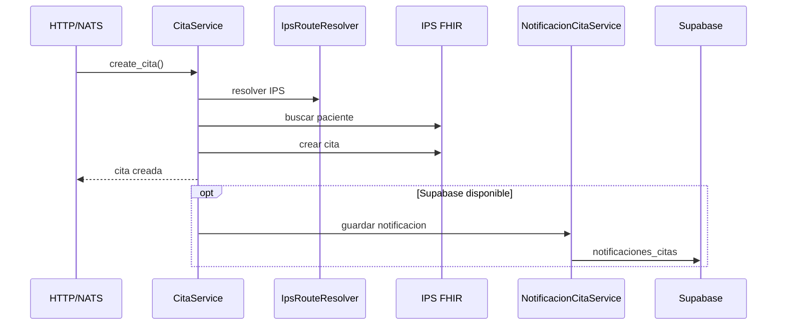
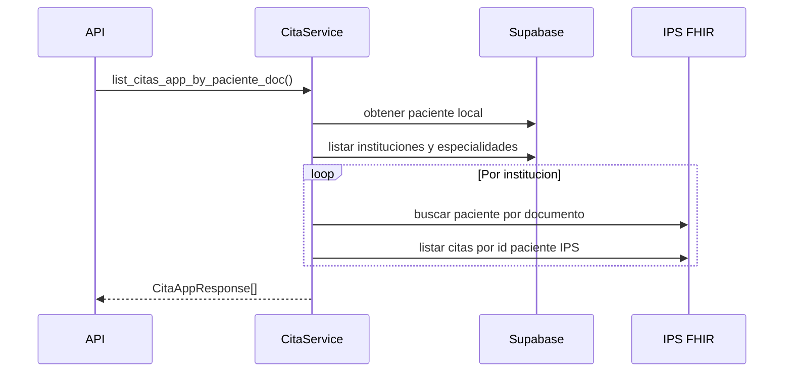
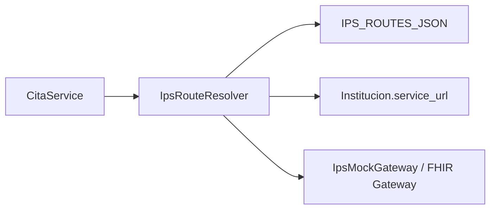

# Cambios de limpieza

Resumen breve para actualizar documentación y diagramas.

## Objetivo

Se hicieron cambios de bajo y mediano riesgo para limpiar el proyecto sin cambiar contratos públicos:

- No cambiaron rutas HTTP.
- No cambiaron schemas de request/response.
- No cambiaron subjects NATS.
- No se rediseñó la arquitectura.

## Cambios principales

### Configuración y entorno

- Se agregó `pytest.ini` para ejecutar `pytest` sin `PYTHONPATH=.`
- Se agregó `tests/conftest.py` con `JWT_SECRET=test-secret` para pruebas.
- Se completó `.env.example` con variables faltantes:
  - `JWT_SECRET`
  - variables `IPS_*`
  - variables `NATS_*`
  - `AI_SERVICE_URL`
- Se renombró `dockerfile` a `Dockerfile`.
- Se actualizó `README.md` con comandos y variables reales.

### Limpieza de código

- Se eliminaron imports y variables no usadas.
- Se quitaron comentarios viejos y notas con emojis.
- Se eliminaron `print()` de depuración en notificaciones.
- Se quitó un endpoint comentado antiguo en `app/api/routes/cita.py`.
- Se eliminaron métodos internos no usados en `CitaService`:
  - `list_all_citas_by_paciente`
  - `list_citas_app_by_paciente`

### Refactor de `CitaService`

`CitaService` sigue siendo el módulo central de citas, pero ahora está más separado internamente.

Se extrajeron helpers para:

- registrar notificación al crear cita,
- registrar notificación al reprogramar cita,
- eliminar notificación al cancelar cita,
- construir respuestas `CitaAppResponse`,
- construir mapas de especialidades,
- resolver rutas IPS con `supabase` opcional.

## Flujos que deben reflejar los diagramas

### Crear cita



### Listar citas del paciente

El flujo vigente usa el documento del paciente, no solo el `id_paciente` local.



### Resolver IPS



## Puntos importantes para diagramas

- `IpsMockGateway` debe dibujarse como gateway FHIR/IPS, aunque el nombre siga diciendo "Mock".
- `NotificacionCitaService` es efecto secundario, no parte obligatoria del éxito de una cita.
- NATS y HTTP son dos entradas hacia los mismos servicios de dominio.
- Magic links usan `JWT_SECRET`.
- `Dockerfile` es ahora el nombre correcto del build.

## Validación

Comandos ejecutados:

```bash
venv/bin/python -m compileall -q app tests
venv/bin/python -m pytest
AI_SERVICE_URL=http://ai-service docker compose config --quiet
```

Resultado:

```text
75 passed
```
